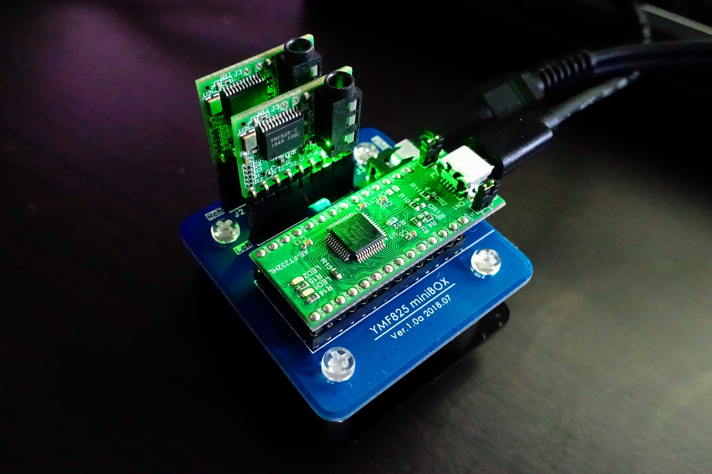
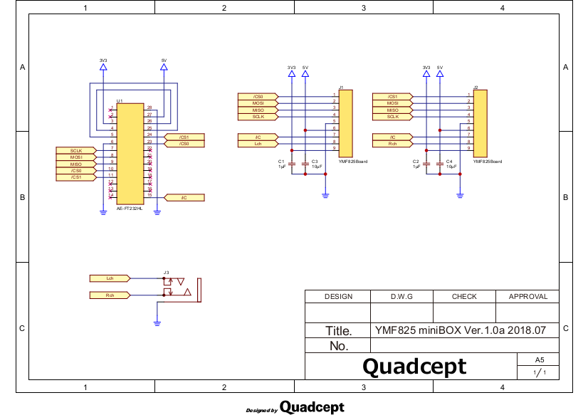
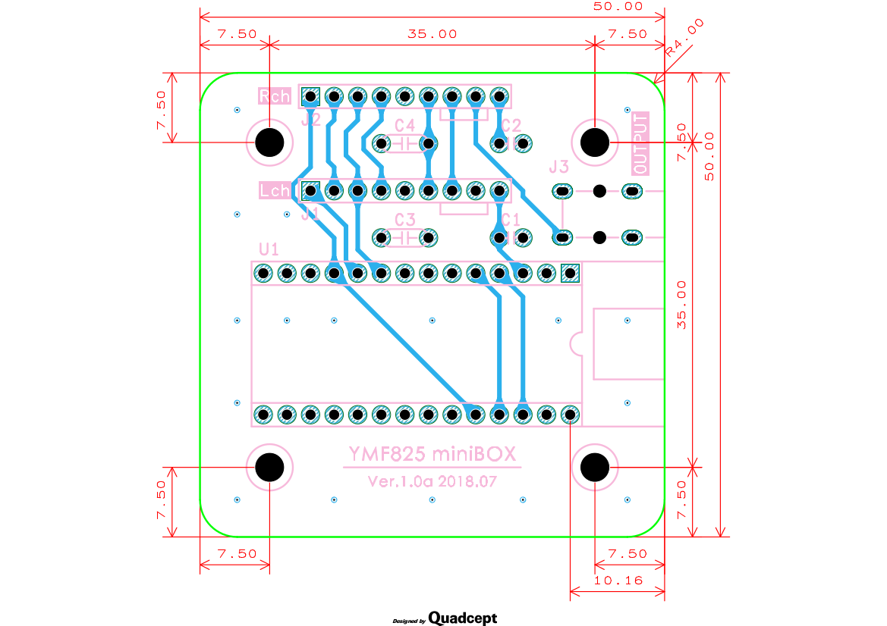
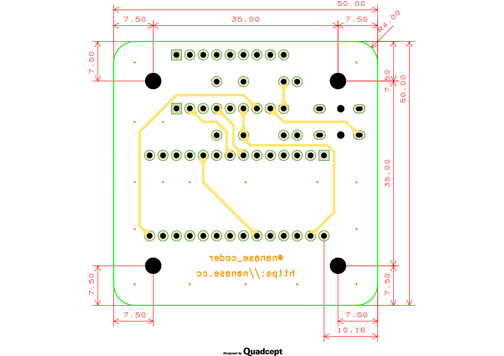
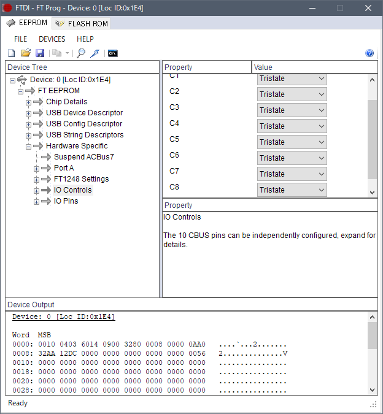
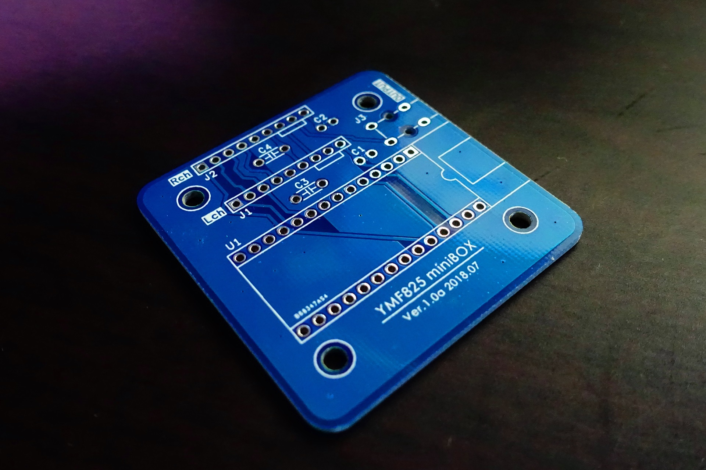
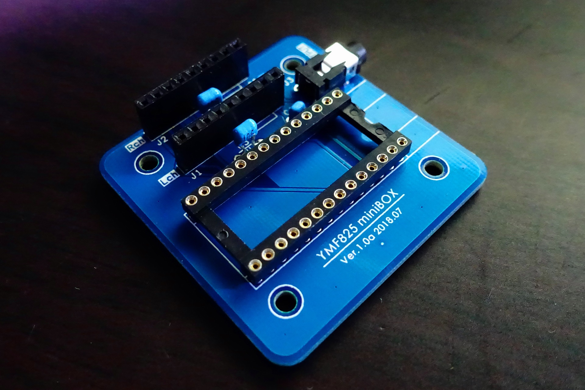

YMF825 miniBOX Ver.1.0a 2018.07
===============================

## 回路図 / PCB

回路図 | Top面 | Bottom面
:--------------------------:|:--------------------------:|:--------------------------:
 |     | 
[PDF](schematic.pdf)        | [PDF](pcb_top.pdf)         | [PDF](pcb_bottom.pdf)

## 部品表

ref  | 数量 | 名称 | 形式 | 入手先URL
-----|-----|-----|-----|-----
C1, C2 | 2 | 積層セラミックコンデンサ | 1μF, 2.54mmピッチ | http://akizukidenshi.com/catalog/g/gP-04066/
C3, C4 | 2 | 積層セラミックコンデンサ | 10μF, 5.08mmピッチ | http://akizukidenshi.com/catalog/g/gP-03095/
U1 | 1 | ハイスピードUSBシリアル変換モジュール | AE-FT232HL | http://akizukidenshi.com/catalog/g/gK-06503/
U1 | 1 | 丸ピンICソケット | 28P 600mil | http://akizukidenshi.com/catalog/g/gP-06740/
J1, J2 | 2 | YMF825Board | 要3.3V化 | http://akizukidenshi.com/catalog/g/gM-12414/
J1, J2 | 2 | ピンソケット | メス 1x9P | http://akizukidenshi.com/catalog/g/gC-10100/
J1, J2 | - | ピンヘッダ | オスL型 1x9P | http://akizukidenshi.com/catalog/g/gC-01627/
J3 | 1 | 小型ステレオミニジャック | 3.5mm | http://akizukidenshi.com/catalog/g/gC-02460/

## 製作の注意点

- YMF825Board は必ず 3.3V 化を施してください。5V のままでは使用できません。
- YMF825Board に取り付けるピンヘッダは本体に対して水平に取り付けてください。垂直に取り付けてしまうと物理干渉してしまいます。
- AE-FT232HL の JP3, JP4 の各ジャンパは close (短絡) 状態にしてください。
- AE-FT232HL は丸ピンICソケットの奥まで差し込んでください。
- U1 の丸ピンICソケットは桟ありタイプも取り付け可能です。
- FTDI社製ツール [FT_Prog](http://www.ftdichip.com/Support/Utilities.htm) を使って、AE-FT232HL の EEPROM を書き換え、ピン設定を変えてください。Hardware Specific -> IO Controls の **C8** と **C9** を **Tristate** に設定し、**Program** (書き換え) を実行してください。

## ドライバ

Windows の場合、FTDI社提供のドライバが必要になります。デバイスマネージャーでは「USB Serial Port (COMxx)」として認識します。

http://www.ftdichip.com/Drivers/D2XX.htm

## 応用
### アクリルパネルについて

[45基板用アクリルパネル](http://akizukidenshi.com/catalog/g/gP-12444/) が適合します。ネジ径は 3mm に対応しています。

### モノラル再生

Lch, Rch いずれかのモノラル再生をする場合は必ず YMF825Board 本体のミニジャックを使ってください。OUTPUT 端子に接続すると片側が無音になります。

### 他基板との互換性

[YMF825Boardステレオ化基板](https://sites.google.com/site/lostechmsx/home/products/ymf825stereo) の AE-FT232HL のピンアサインとは同一になっています。YMF825Boardステレオ化基板 で実行可能なソフトウェアは miniBOX にも対応できます。

## 参考画像

基板 | 実装後 | モジュール接続後
:--------------------------:|:--------------------------:|:--------------------------:
 |     | 
